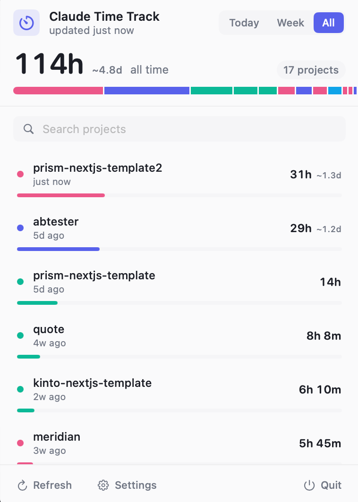
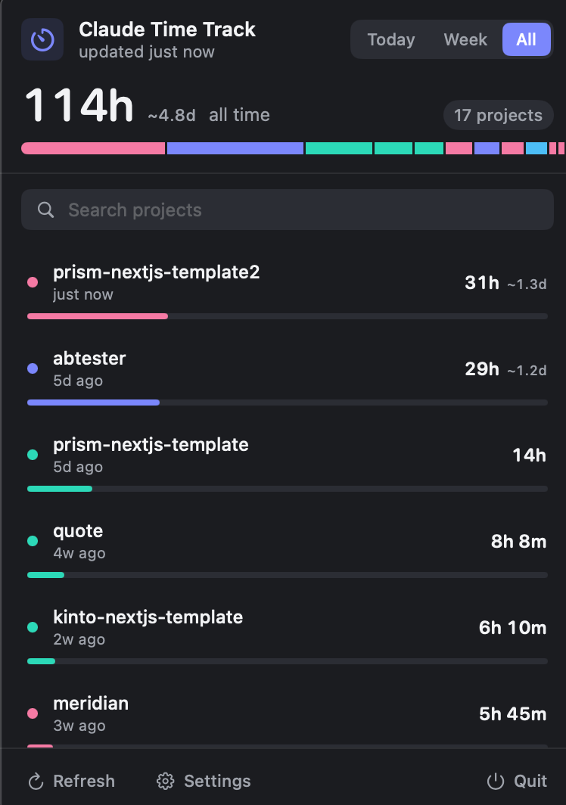

# Claude Time Track

A macOS menu bar app that shows how much time you've spent in each project,
tracked automatically from Claude Code's session files in `~/.claude/projects/`.

No instrumentation, no extension to install. If you use Claude Code, the data
is already on disk.

## Screenshots

| Light Mode | Dark Mode |
|---|---|
|  |  |

## How it works

Every Claude Code message is logged with a `timestamp` and a `cwd`. The app
parses every session JSONL file under `~/.claude/projects/`, resolves each
event to its git repo root, and groups them by project.

Within each session file, consecutive events are stitched into "sittings".
Any gap longer than the configured idle threshold (default **15 min**) splits
a sitting; the active time of a sitting is the wall-clock span between its
first and last message. Long idle gaps are dropped, so leaving Claude Code
open overnight does not pad your numbers.

The menu bar title shows the total for the selected range — Today / This week
/ All time — refreshed every minute by default.

## Build & install

```bash
./build_app.sh
open ~/Applications/ClaudeTimeTrack.app
```

The script:
1. Compiles a release binary with SwiftPM
2. Assembles `~/Applications/ClaudeTimeTrack.app` with a proper `Info.plist`
   (`LSUIElement=true`, so the app is menu-bar-only)
3. Ad-hoc codesigns the bundle so `SMAppService` will accept it for
   launch-at-login

On first launch the app registers itself for **launch at login** automatically
via `SMAppService.mainApp.register()`. You can toggle this from Settings.

## Features

- **Three time ranges** — Today, This week, All time, switchable from the header pill
- **Live totals** in the menu bar title, refreshed every minute
- **Stacked breakdown bar** at the top showing every project's share
- **Per-project rows** — palette color, duration with day hint, last-active
  label, and proportion bar. Hover reveals the path plus Reveal-in-Finder,
  Hide, and Drill-in actions
- **Project detail view** — Today / Week / All-time stats, session and message
  counts, a 14-day sparkline, and the last 20 sittings with their time ranges
- **Search** to filter projects by name or path
- **Settings** — launch-at-login, idle-gap threshold (1–60 min), refresh
  interval (15–600 s), max rows shown, hidden projects
- **Adaptive theme** with a glassy `NSVisualEffectView` background

## Development

```bash
swift build
.build/debug/ClaudeTimeTrack    # logs to stdout
```

Requirements: macOS 14+, Swift 5.10+.

## Project layout

```
Models/      SessionEvent, ProjectUsage, TimeRange, Theme
Services/    SessionTracker (JSONL parser + per-file mtime cache),
             GitRootResolver
State/       AppState (@Observable, settings, launch-at-login, refresh timer)
Utilities/   TimeFormat
Views/       ContentView, MainView, HeaderView (+ TimeRangePicker, SearchBar),
             ProjectListView, ProjectRowView, ProjectDetailView, FooterView,
             SettingsView
```

## Uninstall

```bash
rm -rf ~/Applications/ClaudeTimeTrack.app
defaults delete com.yassinezaanouni.claudetimetrack
```

Then unregister launch-at-login from System Settings → General → Login Items.

## License

MIT
