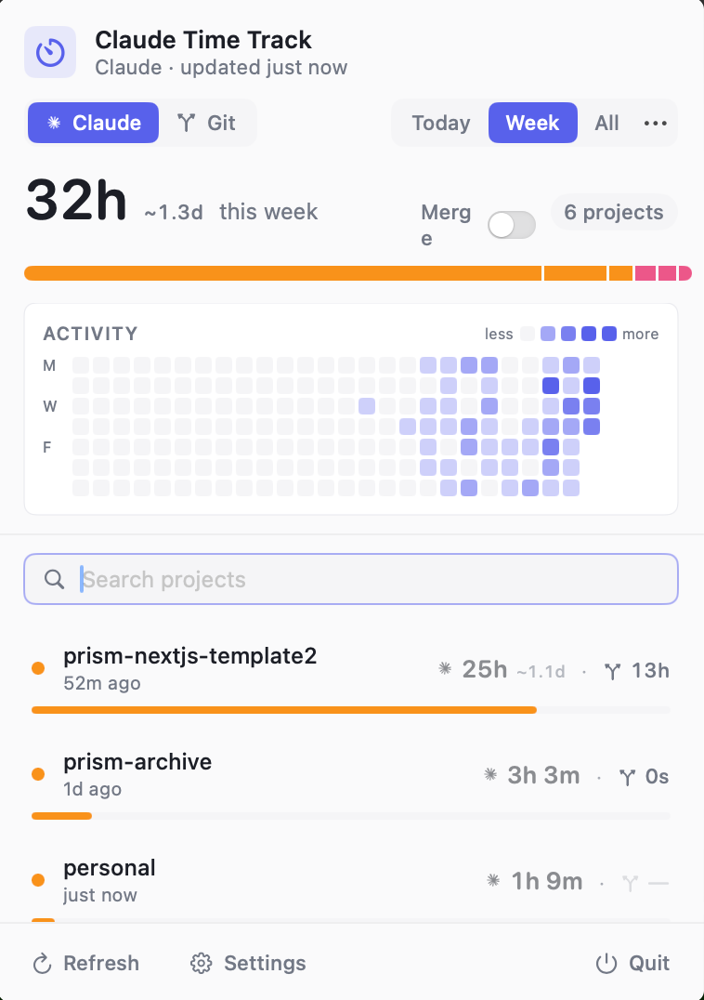
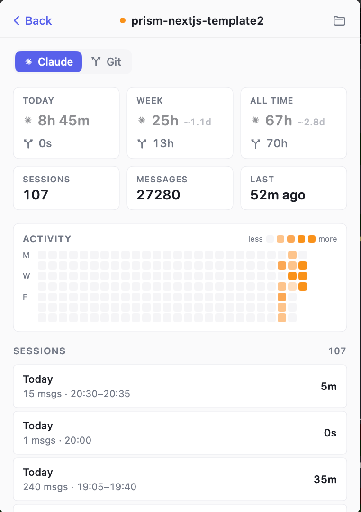

# Claude Time Track

A macOS menu bar app that shows how much time you've spent in each project — tracked from Claude Code's session files and your git history. No instrumentation, no extension. If you use Claude Code or git, the data is already on disk.

| Overview | Project detail |
|---|---|
|  |  |

## Features

- **Two data sources, side by side** — every row shows both Claude session time and `git-hours` commit time. Tap either to flip the active view.
- **Time ranges** — Today / Yesterday / This week / Last week / This month / Last month / All time, with the live total in the menu bar.
- **Activity heatmap** — GitHub-style 26-week calendar on the main popover (aggregated) and per project. Click any day to drill in: totals, sorting, and the session list scope to that day.
- **Merge overlaps** — toggle on the total bar that de-duplicates concurrent work so two projects running at the same time don't double-count toward your total. The list reorganizes into "Overlap N" cards (each contributor's share of the window) plus a "Solo" section for non-overlapping time, and the breakdown bar switches to a timeline view where overlap regions visibly layer.
- **Project search** — filter the list by project name.
- **Stacked breakdown bar** of project shares (or a timeline bar in merge mode).
- **Project detail view** — Today / Week / All-time stats for both sources, sessions / messages / last-active, activity heatmap, and the last 20 sittings (Claude) or commit summary (Git).
- **Missing-data indicator** — if Claude Code has pruned old session JSONLs but the index still references them, the project shows a ⚠️ and a banner explaining what's gone.
- **Compact while you scroll** — the activity heatmap auto-collapses when you scroll the project list so more rows fit, and re-expands when you scroll back up or pull past the top.
- **Appearance** — System / Light / Dark.
- **Hands-off** — auto-refresh every minute, launch-at-login, hide projects you don't care about.

## How it works

**Claude mode.** Every Claude Code message has a `timestamp` and a `cwd`. The app parses every JSONL under `~/.claude/projects/`, resolves each event to its git repo root, and stitches consecutive events into sittings. Gaps longer than the idle threshold (default **15 min**) split sittings, so leaving Claude open overnight doesn't pad your numbers.

**Git mode.** For each repo, the app runs `git log --no-merges --pretty=format:%aI` (filtered by your global `user.email`) and applies the [`git-hours`](https://github.com/kimmobrunfeldt/git-hours) heuristic: gaps **≤ 2 h** count as work; longer gaps mark a new session and add a flat **2 h** for the opening commit. Both thresholds are configurable. Cached per repo by `HEAD` SHA.

## Install

```bash
./build_app.sh
open ~/Applications/ClaudeTimeTrack.app
```

The script compiles a release binary, assembles a `.app` bundle (`LSUIElement=true`, menu-bar-only), and ad-hoc codesigns it so `SMAppService` accepts it for launch-at-login. On first launch the app registers itself; toggle from Settings.

## Develop

```bash
swift build
.build/debug/ClaudeTimeTrack    # logs to stdout
```

Requires macOS 14+, Swift 5.10+.

## Uninstall

```bash
rm -rf ~/Applications/ClaudeTimeTrack.app
defaults delete com.yassinezaanouni.claudetimetrack
```

Then unregister launch-at-login from System Settings → General → Login Items.

## Credits

Git-mode estimate uses the algorithm from [`kimmobrunfeldt/git-hours`](https://github.com/kimmobrunfeldt/git-hours).

## License

MIT
